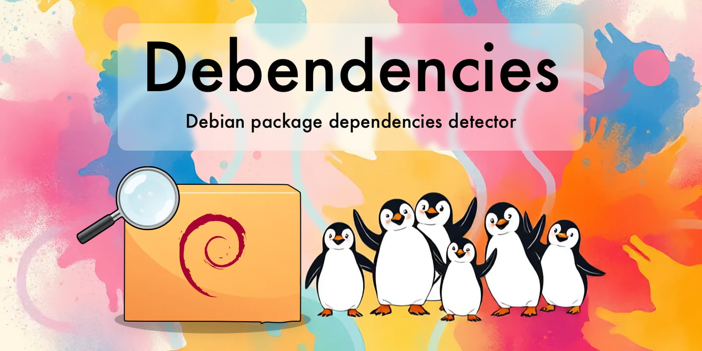

# Debian package shared library dependencies detector



Debendencies scans executables and shared libraries for their shared library dependencies, and outputs a list of Debian package names that provide those libraries. It fulfills the same role as [dpkg-shlibdeps](https://manpages.debian.org/stable/dpkg-dev/dpkg-shlibdeps.1.en.html) but can be used as a standalone tool instead of being tied to the official Debian package building process. This means that Debendencies can be used in combination with [fpm](https://github.com/jordansissel/fpm) or other packaging tools.

For a detailed description of what happens under the hood, see [How it works](HOW-IT-WORKS.md).

## Installation

### RubyGems

```
gem install debendencies
```

### Debian package

Download a .deb file from the [Releases](https://github.com/FooBarWidget/debendencies/releases) page.

## CLI usage

```bash
# Scan a single executable or library
debendencies PATH_TO_ELF_FILE

# Recursively scan all executables and libraries in a directory
debendencies PATH_TO_DIRECTORY
```

Example:

```
$ debendencies /bin/tar
libacl1, libselinux1 (>= 1.32), libc6
```

You can also output as JSON:

```
$ debendencies /bin/tar --format json
[{"name":"libacl1"},{"name":"libselinux1","version_constraints":[{"operator":">=","version":"1.32"}]},{"name":"libc6"}]
```

See `--help` for more options.

## API usage

NOTE: The API is only available when installing from RubyGems.

```ruby
require "debendencies"

scanner = Debendencies.new
# Scan one or more files
scanner.scan('/bin/tar', '/bin/bash', ...)
# Scan one or more directories recursively
scanner.scan('/bin')

# Returns a list of Debendencies::PackageDependency
scanner.resolve
```

See [lib/debendencies/package_dependency.rb](https://github.com/FooBarWidget/debendencies/blob/main/lib/debendencies/package_dependency.rb) for the definition of PackageDependency.

On error, `#scan` and `#resolve` raise `Debendencies::Error`.
